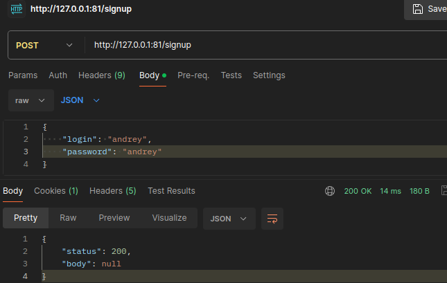
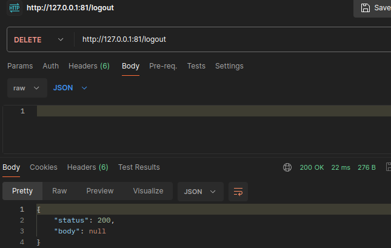
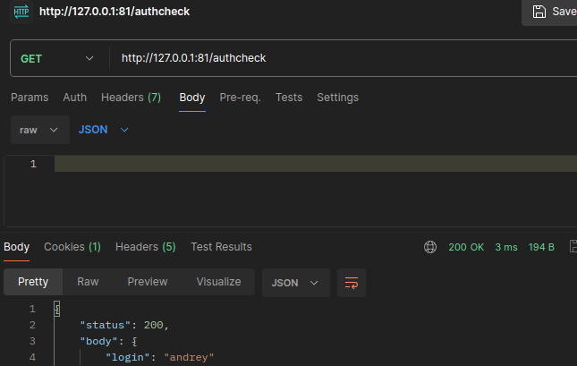
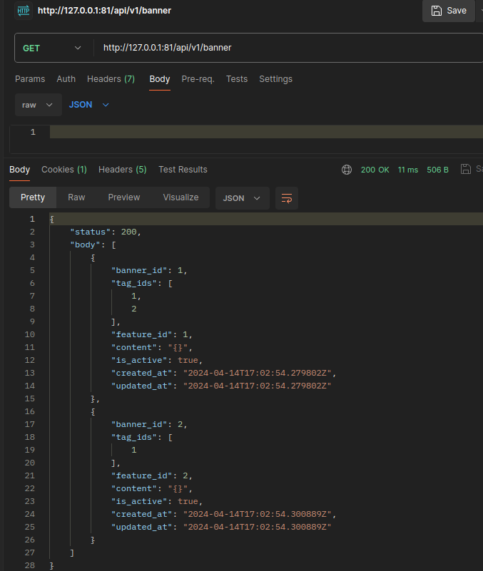
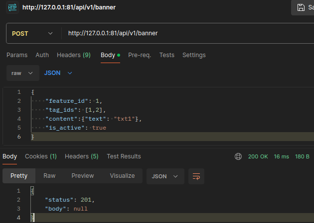
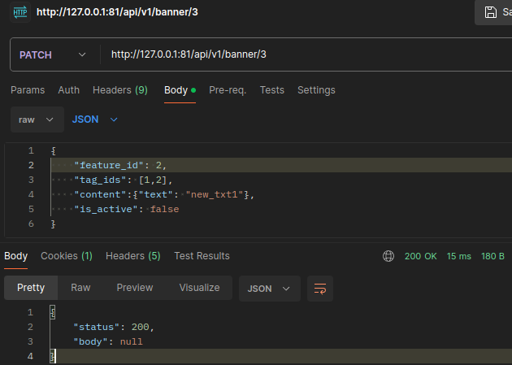
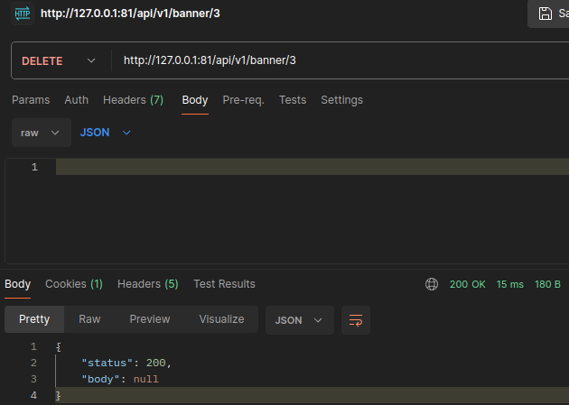

# [Avito-Banner](https://github.com/avito-tech/backend-trainee-assignment-2024)

Приложение запускается командой:
```
make up
```

Приложение микросервисное, общение между сервисами происходит по GRPC API. Общение между браузером и сервисом происходит через REST API. Присутствуют 2 сервиса: авторизации и баннеров. В сервисах реализована Чистая архитектура. Api отвечает за обработку запросов, usecase за бизнес логику, repo за работу с БД.
Также присутствует контейнер c Nginx.
Для системы авторизации и сохранения сессий была выбрана бд кэширования Redis. Для получения данных пользователя и баннеров была выбрана бд PostgreSQL.

## Сервис авторизации
### Авторизация.
#### POST /signin
Результатом успешной авторизации является выдача cookie. Пример: <br/>


### Регистрация
#### POST /signup
Результатом успешной регистрации является создание нового пользователя в БД. Пример: <br/>


### Выход
#### DELETE /logout
Для выхода из аккаунта необходима кука session_id, которая была получена при авторизации. <br/>


### Проверка авторизации
#### GET /authcheck
Аутентификация пользователя. Проверка проходит по куке session_id. <br/>


## Сервис баннеров
### Получение баннеров.
#### GET /api/v1/banner 
Получение баннеров<br/>


### Создание нового баннера.
#### POST /api/v1/banner
Создание баннера<br/>


### Изменение баннера.
#### PATCH /api/v1/banner/{id}
Изменение баннера<br/>


### Удаление баннера.
#### DELETE /api/v1/banner/{id}
Удаление баннера<br/>
