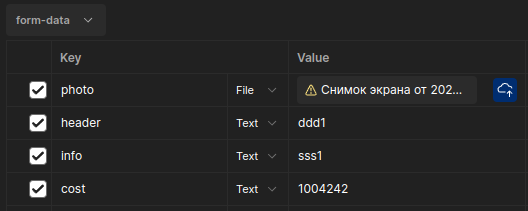

# Announcement

Приложение запускается командой:
```
docker-compose --env-file .env up --build
```

Приложение микросервисное, общение между сервисами происходит по GRPC API. Общение между браузером и сервсиом происходит через REST API. Присутствуют 2 сервиса: авторизации и объявлений. В сервисах реализована Чистая архитектура. Api отвечает за обработку запросов, usecase за бизнес логику, repo за работу с БД.
Для системы авторизации и сохранения сессий была выбрана бд кэширования Redis. Для получения данных пользователя и маркетплейса была выбрана бд PostgreSQL.

## Сервис авторизации (127.0.0.1:8081)
### Авторизация.
#### POST /signin
Результатом успешной авторизации является отдача cookie. Пример запроса:
```
{
    "login":"admin",
    "passsword": "admin"
}
```
### Регистрация
#### POST /signup
Результатом успешной регистрации является создание нового пользователя в БД. Пример запроса:
```
{
    "login":"admin",
    "passsword": "admin"
}
```

### Выход
#### DELETE /logout
Для выхода из аккаунта необходима кука session_id, которая была получена при авторизации.

### Проверка авторизации
#### GET /authcheck
Аутентификация пользователя. Проверка проходит по куке session_id.

## Сервис объявлений (127.0.0.1:8082)
### Получение конкретного объявления по его id.
#### GET /api/v1/announcements
Пример запроса (Query параметр):
```
{
    "id":"1",
}
```
Пример результата:
```
{
    "status": 200,
    "body": {
        "header": "header2",
        "info": "href2",
        "photo_href": "info2",
        "cost": 2300
    }
}
```

### Получение списка объявлений.
#### GET /api/v1/announcements/list
По умолчанию отсортирован по дате добавления. Есть несколько query параметров:

page - Необходим для пагинатора. С какой страницы начинаем.

per_page - Необходим для пагинатора. Шаг поиска.

Пример запроса в Query параметрах:
```
{
    "page": 0
    "per_page": 2,
}
```

Пример ответа:
```
{
    "status": 200,
    "body": {
        "Count": 2,
        "Announcements": [
            {
                "header": "header2",
                "info": "href2",
                "photo_href": "info2",
                "cost": 2300
            },
            {
                "header": "header1",
                "info": "href1",
                "photo_href": "info1",
                "cost": 1300
            }
        ]
    }
}
```

### Поиск объявлений.
#### GET /api/v1/announcements/search
По умолчанию отсортирован по дате добавления. Есть несколько query параметров:

page - Необходим для пагинатора. С какой страницы начинаем.

per_page - Необходим для пагинатора. Шаг поиска.

sort_by - может быть равен cost (сортировка по стоимости от макс до мин) и по date (сортировка по дате).

min_cost - минимальная стоимость (по умолчанию 0).

max_cost - максимальная стоимость.

Пример запроса по Query параметрам:
```
{
    "page": 0,
    "per_page": 3
    "sort_by": "cost",
    "min_cost":0,
    "max_cost": 3000,
}
```

Пример ответа:
```
{
    "status": 200,
    "body": {
        "Count": 3,
        "Announcements": [
            {
                "header": "header2",
                "info": "info2",
                "photo_href": "href2",
                "cost": 2300
            },
            {
                "header": "header1",
                "info": "info1",
                "photo_href": "href1",
                "cost": 1300
            },
            {
                "header": "h2",
                "info": "info12",
                "photo_href": "./images/Снимок экрана от 2024-03-28 21-58-43.png",
                "cost": 1001
            }
        ]
    }
}
```

### Создание объявления.
#### POST /api/v1/announcements/create
Для этой ручки необходима cookie.
Пример запроса (Content-type: form-data):



Пример ответа:
```
{
    "status": 200,
    "body": null
}
```
